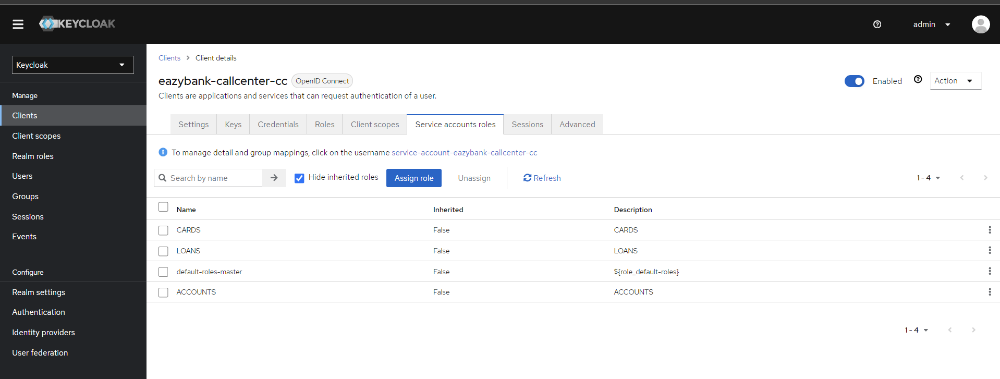

Microservices Security
---------------------

1. Implement an Authorization server instead of mixing business logic with auth
2. https://www.keycloak.org/ is an opensource authorization server
3. Create a client
   4. ID
   5. Secret
4. assign the roles


Add Authentication and Authorization in Gateway server - Client Authorization Grant flow
--------------------------------------------
1. Add the spring boot starter security dependencies
2. ```xml
	<dependency>
			<groupId>org.springframework.boot</groupId>
			<artifactId>spring-boot-starter-security</artifactId>
		</dependency>
		<dependency>
			<groupId>org.springframework.security</groupId>
			<artifactId>spring-security-oauth2-resource-server</artifactId>
		</dependency>
		<dependency>
			<groupId>org.springframework.security</groupId>
			<artifactId>spring-security-oauth2-jose</artifactId>
		</dependency>
    ```
   3. Add the security configuration class stating authentication and authorization 
      4. ```java
    
          @Configuration
          @EnableWebFluxSecurity
          public class SecurityConfig {
    
              @Bean
              public SecurityWebFilterChain springSecurityFilterChain(ServerHttpSecurity serverHttpSecurity) {
                  serverHttpSecurity.authorizeExchange(exchanges -> exchanges.pathMatchers(HttpMethod.GET).permitAll()
                          .pathMatchers("/eazybank/accounts/**").hasRole("ACCOUNTS")
                          .pathMatchers("/eazybank/cards/**").hasRole("CARDS")
                          .pathMatchers("/eazybank/loans/**").hasRole("LOANS"))
                          .oauth2ResourceServer(oAuth2ResourceServerSpec -> oAuth2ResourceServerSpec
                                  .jwt(jwtSpec -> jwtSpec.jwtAuthenticationConverter(grantedAuthoritiesExtractor())));
                  serverHttpSecurity.csrf(csrfSpec -> csrfSpec.disable());
                  return serverHttpSecurity.build();
              }
    
              private Converter<Jwt, Mono<AbstractAuthenticationToken>> grantedAuthoritiesExtractor() {
                  JwtAuthenticationConverter jwtAuthenticationConverter =
                          new JwtAuthenticationConverter();
                  jwtAuthenticationConverter.setJwtGrantedAuthoritiesConverter
                          (new KeycloakRoleConverter());
                  return new ReactiveJwtAuthenticationConverterAdapter(jwtAuthenticationConverter);
              }
    
          }
                     public class KeycloakRoleConverter  implements Converter<Jwt, Collection<GrantedAuthority>> {
            
                      @Override
                      public Collection<GrantedAuthority> convert(Jwt source) {
                          Map<String, Object> realmAccess = (Map<String, Object>) source.getClaims().get("realm_access");
                          if (realmAccess == null || realmAccess.isEmpty()) {
                              return new ArrayList<>();
                          }
                          Collection<GrantedAuthority> returnValue = ((List<String>) realmAccess.get("roles"))
                                  .stream().map(roleName -> "ROLE_" + roleName)
                                  .map(SimpleGrantedAuthority::new)
                                  .collect(Collectors.toList());
                          return returnValue;
                      }
            
               }
          ```
4. Read the properties of resource server which will help to validate the user tokens
    
5. Grant the roles to user or microservices
    

Securing Gateway server using Authorization Code grant type flow 
--------------------------------------------------
1. Authentication of end user via Outh
2. Create a Client via Keycloak Apis
3. Create a User via Keycloak apis
4. See the docs theory

